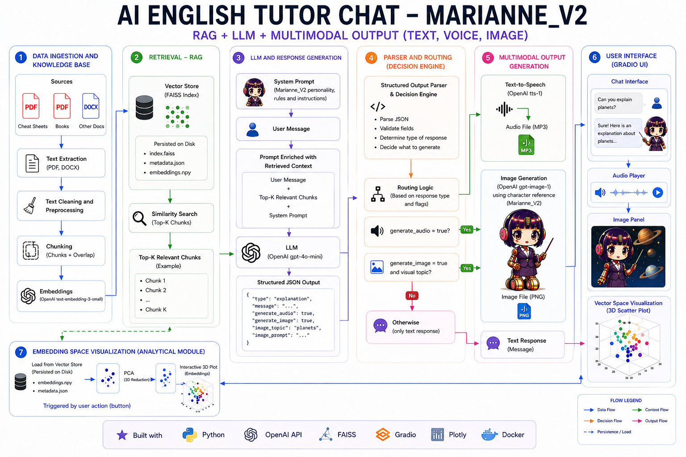
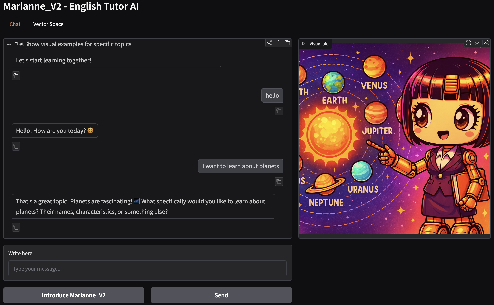
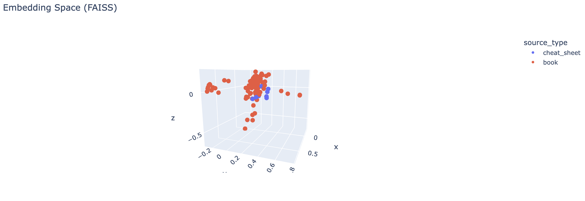

# 🧠 AI English Tutor - Marianne_V2

Aplicación de Inteligencia Artificial para aprender inglés mediante un tutor conversacional multimodal basado en LLMs, RAG, voz e imagen.

El sistema integra una tutora virtual llamada **Marianne_V2**, capaz de corregir errores, explicar conceptos, mantener conversaciones naturales, generar voz y crear imágenes educativas manteniendo una identidad visual consistente.

## 🎯 Objetivo

Construir un **asistente inteligente de aprendizaje de inglés** con arquitectura modular, capaz de combinar:

- recuperación de conocimiento mediante RAG
- generación de respuestas estructuradas con LLMs
- voz mediante Text-to-Speech
- generación de imágenes educativas
- visualización del espacio vectorial de embeddings

---

## 🧩 Funcionalidades actuales

- 💬 Chat conversacional en inglés  
- ✏️ Corrección automática de frases  
- 📖 Explicación de errores gramaticales
- 📚 RAG con PDFs y DOCX usando FAISS
- 🔎 Recuperación de contexto relevante mediante embeddings
- 🔊 Text-to-Speech con OpenAI
- 🖼️ Generación de imágenes educativas con referencia visual de Marianne_V2 
- 🤖 Identidad visual del personaje mediante imágenes de referencia
- 📊 Visualización 3D del espacio vectorial con PCA + Plotly
- 🖥️ Interfaz interactiva con Gradio 

---

## 🏗️ Arquitectura

## 📊 Resultados

